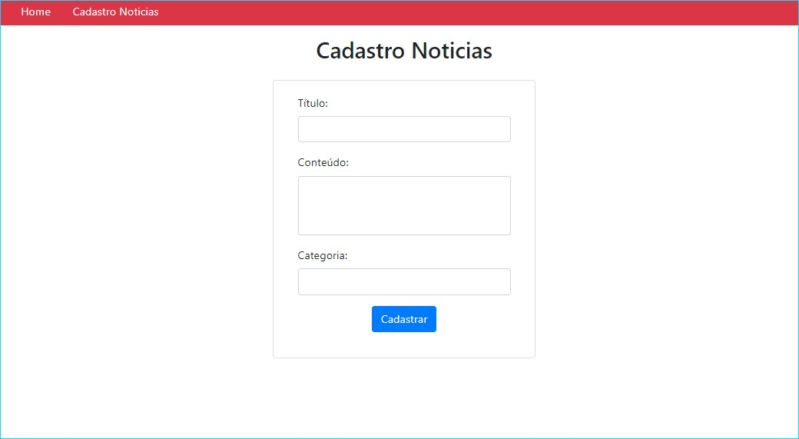
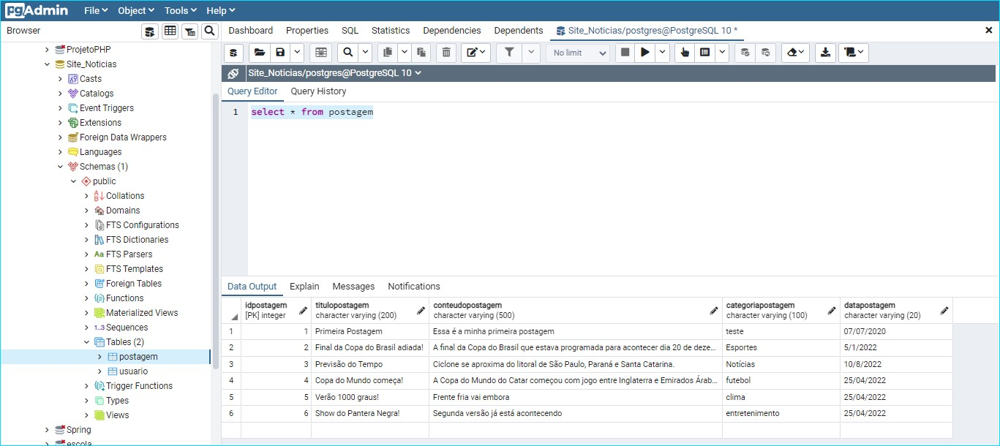
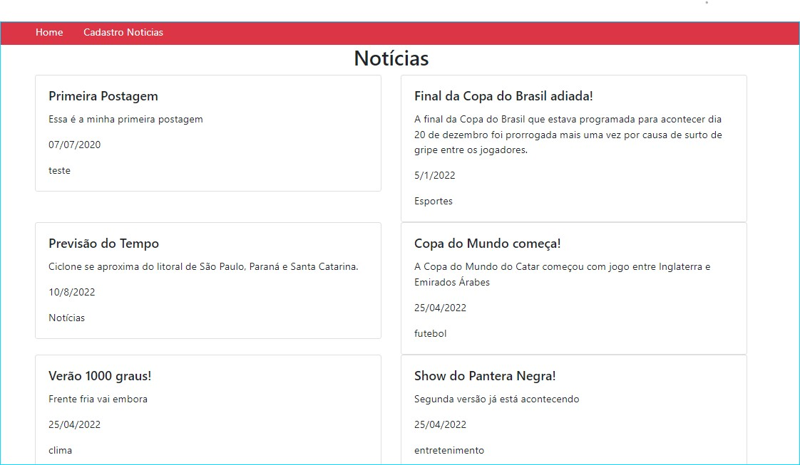

<h1 align="center">
   Site_Noticias
</h1>  

Projeto front-end de postagens desenvolvido em HTML, CSS e JavaScript. Em conjunto com <a href="https://github.com/Gilvan-R-A/API_Node">API_Node</a>, permite ao usuário cadastrar e visualizar postagens de notícias.   

## Tela de Cadastro

   

## Registro no Banco de Dados   

   

## Tela Home

